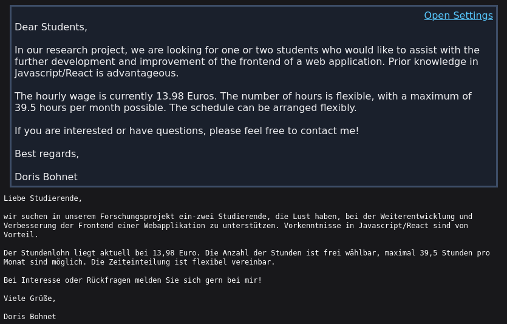
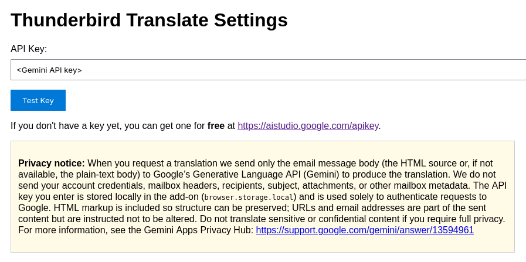

#  [Thunderbird Translate](https://github.com/sully-vian/thunderbird-translate)

Thunderbird Translate adds a one-click translation banner to messages in Thunderbird. Translate an email's body (html or plain text) using the Gemini API and show the translated result at the top of the message.

Banner shown at the top of an email | Options page
:-------------------------:|:-------------------------:
 | 

## Why install

- Quick, in-context translations without switching apps
- Preserves HTML structure for rich messages
- Local API key storage - you control the key.

## Setting up

Just download the add-on, Thunderbird will take care of the installation. Then, you can get one [here](https://aistudio.google.com/apikey) for free.

## Privacy / Data sent

- What is sent: the email message body (text/plain or text/html) is sent to the configured external translation service (Google Generative Language API) for translation.
- What is NOT sent: account passwords or Thunderbird credentials.
- API key: stored locally in Thunderbird browser storage (`browser.storage.local`).
- Recommendation: do not translate sensitive or confidential content.

## Contributing

Contributions welcome, especially concerning the localization.

```bash
# to install the dependencies
npm install

# to compile the project without minifying scripts
npm run build:dev

# to compile project and minify scripts
npm run build:prod

# to package the add-on as an .xpi file
npm run build:web-ext
```

To debug the add-on, load the `dist/manifest.json` file with Thunderbird after building the project.

## License

This project is distributed under the terms in [LICENSE](LICENSE)

## Acknowledgements

- Icon: [Bootstrap Icons - Translate](https://icons.getbootstrap.com/icons/translate/)
- Translation engine: [Google Gemini 2.5 Flash](https://ai.google.dev/gemini-api/docs/models#gemini-2.5-flash)
- HTML purifier: [DOMPurify](https://dompurify.com/)
- Google Gen AI SDK: [@google/genai](https://googleapis.github.io/js-genai)

